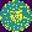
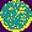
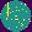

# WM811K Wafer Defect Detection

This project explores **image-based defect detection** on semiconductor wafers using the **WM811K Wafer Map** dataset.  
It combines **C++ image preprocessing** and **Python deep learning (Autoencoder + Classifier)** to build a compact, interpretable, and efficient detection pipeline.

The goal is to automatically recognize and categorize wafer failure patterns.


## 🔍 Overview

In semiconductor manufacturing, every wafer contains thousands of tiny chips (dies).  
After electrical testing, the pass/fail results of each die are visualized as a **wafer map**, an image generated by specialized inspection equipment, where colors or intensities indicate defect locations and patterns such as *Center failures*, *Edge rings*, or *Scratches*.

Instead of relying only on human inspection or rule-based detection, this project applies **machine learning and image processing** to:
- Process and standardize wafer map data (C++)  
- Learn representations of wafer patterns (Autoencoder)  
- Classify wafers into defect types (Neural Network Classifier)  
---

## ⚙️ Pipeline Structure
```
data/LSWMD.pkl ← Original Kaggle dataset
│
├── data_extraction.py → Extract wafer images + metadata
├── preprocessing.cpp → C++ image preprocessing: normalization, masks, distance maps
│
└── WM811K_Autoencoder.ipynb → Autoencoder + Classifier (Keras/TensorFlow)
```

## 🧩 How to Run

### 1. **Data Extraction (Python)**
After downloading the dataset from Kaggle, place the `LSWMD.pkl` file in the `data/` folder, install any missing python packages.  
Then, run:

```bash
python data_extraction.py
```
This script extracts wafer maps and metadata from the .pkl file and saves them as organized .png images by defect type.

### 2. Preprocessing (C++)
Run the C++ preprocessing step to clean and enhance the extracted wafer maps.
It performs:

  + Intensity normalization
  + Edge and center distance channel computation
  + Bad die mask generation

Use Conan and CMake for easy package installation and building:

### 3. Representation Learning (Autoencoder)
Open and run the notebook:
```
WM811K_Autoencoder.ipynb
```
This trains a convolutional autoencoder to learn low-dimensional representations of wafer maps, capturing the geometric and spatial structure of defect patterns.

### 5. Classification
Within the same notebook, the trained encoder is reused as the backbone for a simple classifier that identifies nine major defect types.
The notebook also handles evaluation, reporting metrics such as accuracy and macro-F1 score.

---

## 📊 Results

These results were obtained using a **lightweight model** trained for a **short duration**, focusing on efficiency rather than exhaustive optimization.

- **Autoencoder final loss:** ~0.0034 (good reconstruction)
- **Classifier accuracy:** ~0.91  
- **Macro-F1 score:** ~0.57  

Despite the simplicity of the model, performance was strong on structured defect patterns such as *Center*, *Edge-Ring*, and *Random*.  
More ambiguous or mixed wafers remain challenging, a behavior consistent with real industrial datasets.

---

## 🧩 Example Wafer Maps

| Example | Description |
|----------|--------------|
|  | Center defect pattern |
|  | Edge-Ring defect pattern |
|  | Scratch defect pattern |

---

## 🚀 Next Steps

- Implementing a **C++ rule-based detection module** for fast defect localization and comparison against the ML approach.  
- Exploring **fine-tuning** of the encoder for mixed-pattern wafers.  
- Adding **visual analytics** (heatmaps or reconstruction difference) for better interpretability.

---

## 🧠 Reference

Dataset: [WM811K Wafer Map (Kaggle)](https://www.kaggle.com/datasets/qingyi/wm811k-wafer-map)

> **Wu, Ming-Ju, Jyh-Shing R. Jang, and Jui-Long Chen.**  
> *“Wafer Map Failure Pattern Recognition and Similarity Ranking for Large-Scale Data Sets.”*  
> *IEEE Transactions on Semiconductor Manufacturing 28(1), 2015.*

